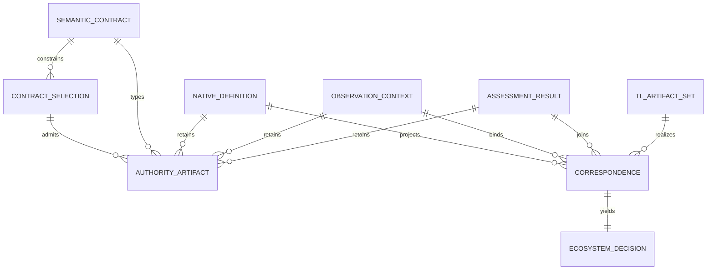

# [DOM-001] Origin-complete temporal assurance ecosystem

## Bounded Context

This context owns the deterministic path from an authority-checked native Quire
temporal definition and immutable observations to versioned TL artifacts,
bounded TL evaluation, canonical protocol results, and an exact native/TL
correspondence decision. It includes the `tl-syntax`, `tl-parse`, `tl-mltl`,
`tl-rewrite`, `quire-contract-ir`, `quire-spec-language`,
`quire-observation`, and `quire-protocol` crates as one application composed of
separately versioned owner subsystems. `quire-specification` is the ninth,
non-runtime subsystem: it owns the shared semantic objects and vocabularies
that those eight executable crates implement or map without restatement.

The context owns no alternative editable requirements language: native Quire is
the sole source language. It owns no ambient monitoring transport, scheduler,
wall clock, evidence store, accreditation decision, or external target
semantics. Those concerns may supply exact immutable inputs or consume exact
outputs only through reviewed contracts.

Within the context, each semantic noun has one authority. `quire-specification`
owns the cross-repository meaning of protocol/temporal/observation objects and
closed vocabularies; `tl-syntax` owns the
canonical TL graph, profile and signal/proposition contracts; `tl-parse` owns
only internal text dialects; `tl-mltl` owns history, request and evaluator
semantics; `tl-rewrite` owns declared equivalence-preserving rewrites;
`quire-spec-language` owns checked native definitions and temporal subjects;
`quire-observation` owns observation, clock/capture, progress, completeness and
availability assertions; `quire-protocol` owns canonical native assessment
results; and the Contract IR repository owns a dependency-free model-foundation
package plus the compatibility bridge package that owns deterministic derived
correspondences, joins and the non-authoritative bounded ecosystem-model export
without restamping any owner identity.

Every cross-owner value is supplied as exact bytes, an immutable contract
selection, and the result of the selected public strict reader. No consumer may
replace that evidence with a Boolean trust flag, display-name comparison,
private wire import, copied schema, callback, parser, evaluator, or network
lookup.

The context also publishes a bounded machine-readable description of its own
components, objects, interfaces, identities, dependency pins and evidence
links. That description is observational: it may support later analysis and
improvement proposals, but cannot authorize its own revision, alter an input,
or certify the system that emitted it.

## Entities

- **ContractSelection** — exact accepted contract/version/repository/revision/schema tuple.
- **AuthorityArtifact** — immutable owner bytes plus identity, revision and digest.
- **NativeDefinition** — checked predicate leaf or temporal subject and its complete source/model/profile binding.
- **ObservationContext** — immutable position, clock, capture, progress, completeness and availability assertions.
- **AssessmentResult** — canonical independent execution/truth/settlement/support/correction record.
- **TLArtifactSet** — formula, catalog/map, history/trace/request/report artifacts under their target contracts.
- **Correspondence** — immutable projection or join binding owner artifacts without replacing their identities.
- **EcosystemDecision** — closed admitted/non-value/refusal/conflict vocabulary and precedence.
- **SemanticContract** — accepted shared object/vocabulary meaning and its exact immutable specification revision.

## Entity Relationship Diagram

## Ubiquitous Language

- **Owner** — the single subsystem permitted to define and validate one semantic object or vocabulary.
- **Selection** — the immutable five-axis contract identity admitted before any bytes under that contract are interpreted.
- **Strict reader** — a bounded public operation that accepts one exact canonical document or returns a typed refusal with no trusted partial value.
- **Authority artifact** — bytes whose identity, revision, digest and semantics are established by their owner, never by a consumer.
- **Projection** — deterministic construction of a new consumer-owned artifact while retaining every source identity.
- **Correspondence** — an immutable relation between exact owner artifacts; it is not equivalence unless its contract says so.
- **Join** — comparison of independently validated producer results under the same correspondence and premise set.
- **Correction** — a new immutable result/input revision linked to an exact direct predecessor; prior bytes never change.
- **Non-value** — incomplete, unavailable, unsupported, failed, refused, or conflict; none is Boolean false.
- **Self-model** — bounded descriptive output about this ecosystem, explicitly lacking authority over the contracts and evidence it describes.
