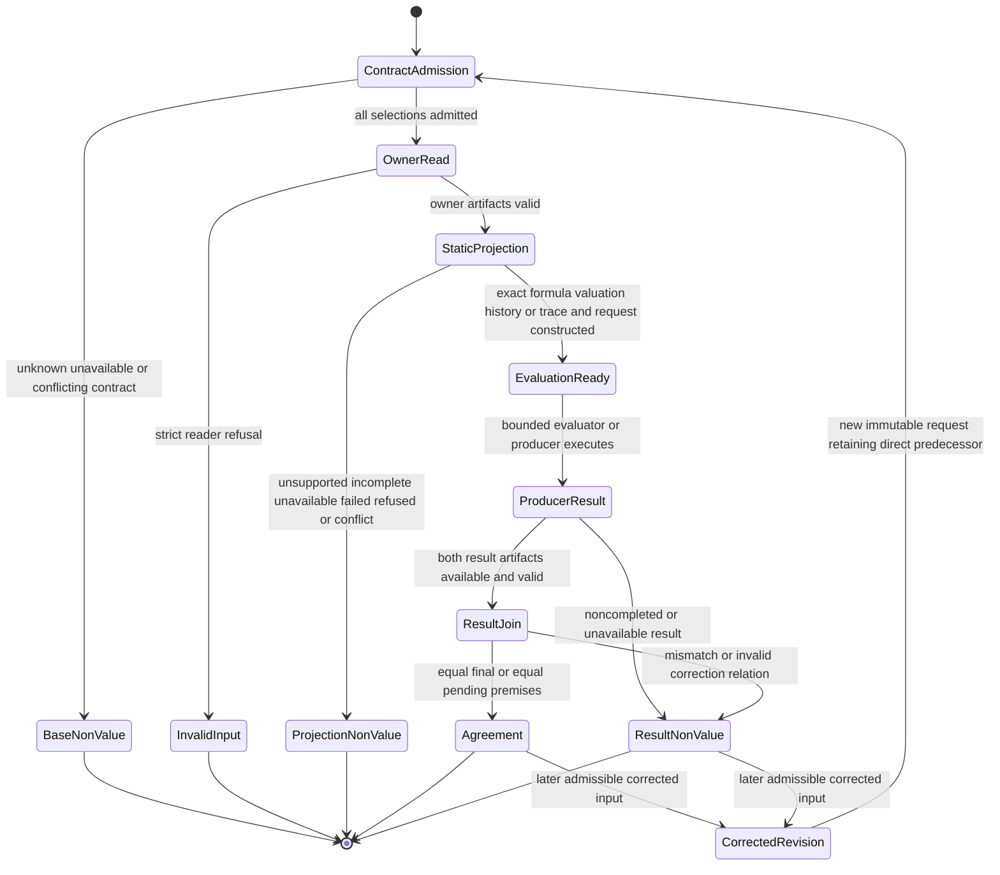

# [SM-001] Temporal assessment artifact lifecycle

## States & Transitions

Every terminal transition returns one complete operation-specific decision or
one operation diagnostic and no usable partial artifact. A correction starts a
new immutable revision; it never mutates or reclassifies the predecessor in
place. Contract admission always precedes interpretation of bytes governed by
that contract.
