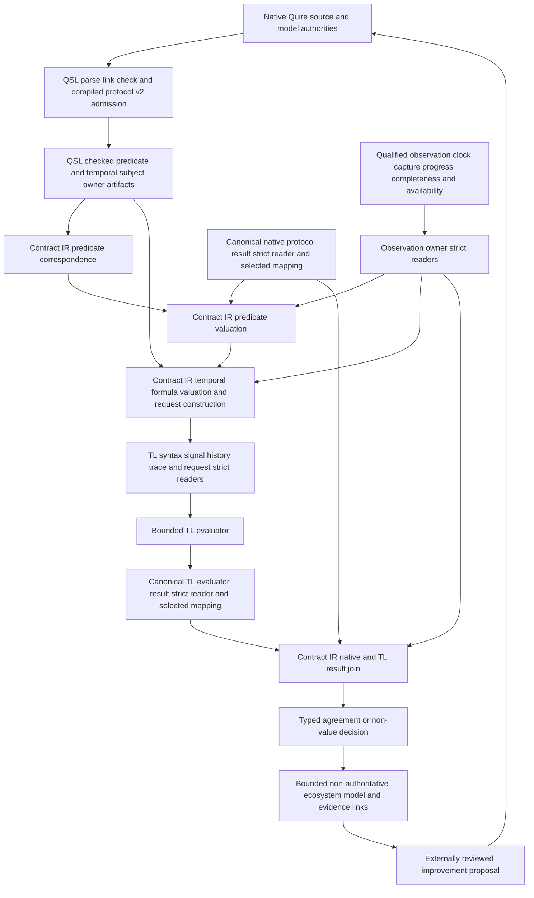
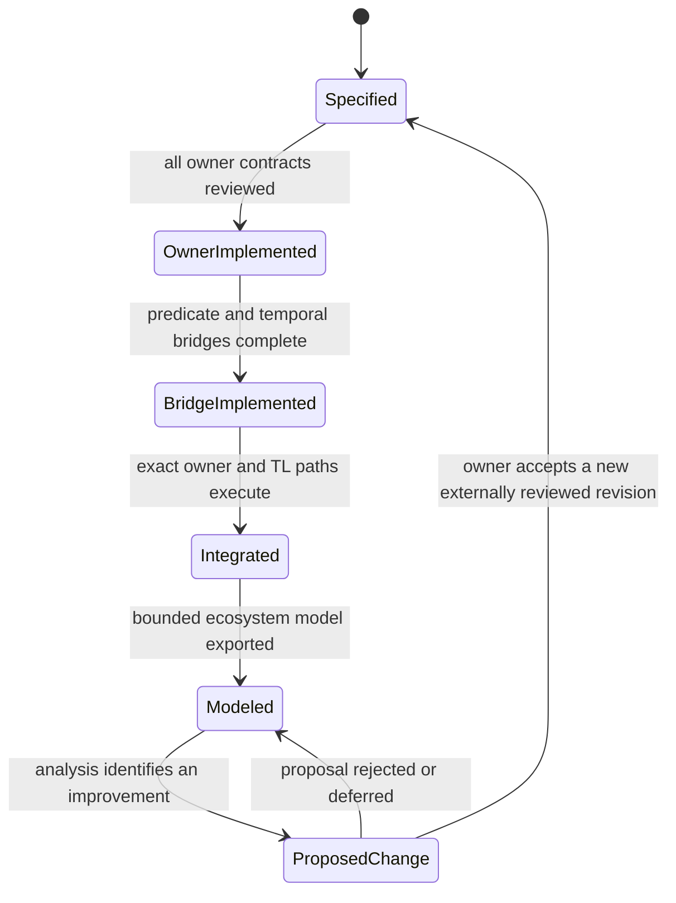

# [PROC-001] Native Quire to canonical TL assessment

This process is the complete application path under epic #52. Each boundary
passes exact immutable artifacts through the public reader selected before the
artifact is interpreted.

## Workflow

## States

## Specification

Contract admission is fail-closed and precedes parsing every authority
artifact. Static predicate projection precedes per-position valuation; complete
predicate valuation precedes temporal request construction; owner result
validation precedes comparison. The process may stop at any boundary with one
typed decision and no partial downstream artifact. Later corrections re-enter
through new immutable owner artifacts rather than mutating a prior state.

The model/proposal loop is deliberately outside the authority path: a proposal
becomes effective only after the same owner specification, review, merge,
contract-selection and strict-reader process as a human-authored change.

## Algorithm

1. Admit every selected contract and exact schema before interpreting governed bytes.
2. Strict-read the compiled native definition and all observation authority artifacts.
3. Derive the sorted predicate population and strict-read its TL signal/proposition artifacts.
4. Map each available native protocol predicate result to one typed valuation; retain every non-value without coercion.
5. Construct and strict-read the exact TL formula, history/trace and evaluator request for the selected profile.
6. Execute the selected bounded TL evaluator and strict-read both producer results.
7. Compare all independent progress, closure, truth, settlement,
   decision-premise, completeness and correction axes.
8. Return one complete decision and retain every owner identity used to derive it.
9. Export the bounded descriptive ecosystem graph; route any suggested change through external owner review.
